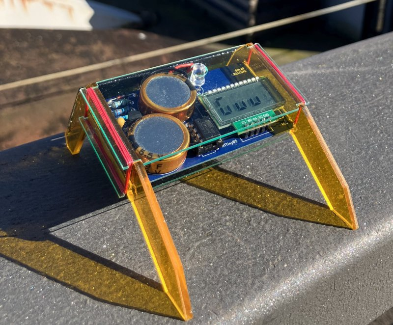
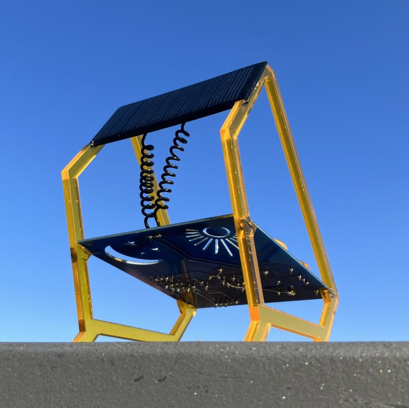
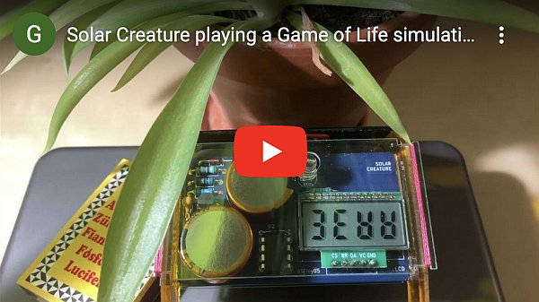

# LCD Solar Creatures

This repository has all the code and design files for the low-power LCD Solar Creatures
[documented on Hackaday](https://hackaday.io/project/185825-lcd-solar-creatures).

The Solar Creatures are based on a simple 7-segment LCD display and an ATTiny85 microcontroller. They store their energy in a pair of 1.5F supercapacitors that can power them through the night.

When the sun shines, the display plays lively animations: a tiny version of Conway's Game of Life, or randomized rhythmic patterns. As the light fades, the animations slow down, and at night the creatures use their high-power red LED instead to beam out a rhythm. The Creatures draw 11.4μA, 7.3μA and 6.2μA in these modes, respectively.

The Solar Creatures are infused with patterns through and through. The animations and the flashes are all randomly parameterized Euclidean rhythms. You will rarely see the same show twice!

They recognize the periodic peaks and lows of energy, and they keep track of their own age in days. They faithfully report this to you in between two animations, and they also tell you how long they were awake in the last few days.

## Electronics

I designed the schematic and PCB of the creatures in KiCad 5.1.9. The circuitry of the two forms is identical, but because the PCB is different, there are two separate projects. You can find them under [electronics/v6](electronics/v6) (for larger the Window Squatter) and under [electronics/vB1](electronics/vB1) (for the smaller Desktop Crawler). The ZIP files with gerber in the name are the exports that I submitted to the PCB fab.

## Laser-cut frame

The frame of both creatures is laser-cut from 3mm acryclic. The vector files for this are in [design](design). The .ai files are the originals, but I included a version re-saved as Inkscape .svg as well.

## Source code
